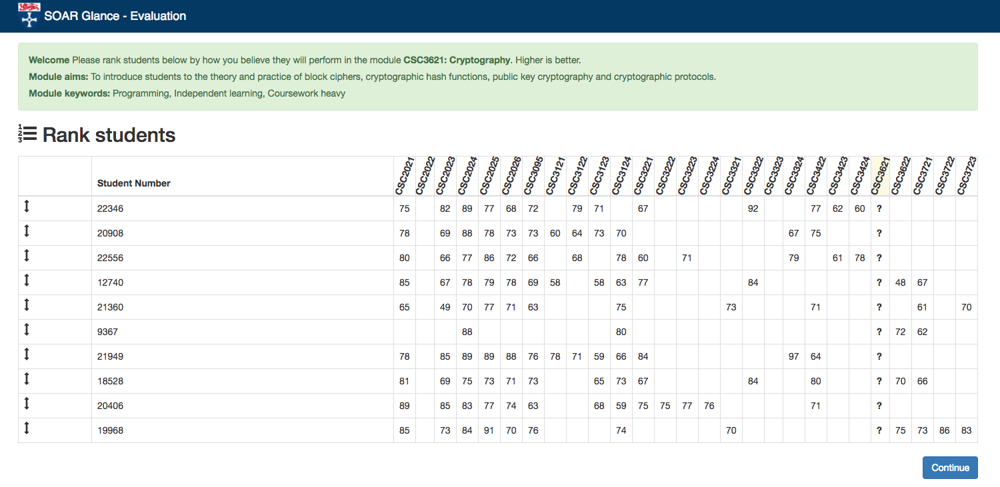
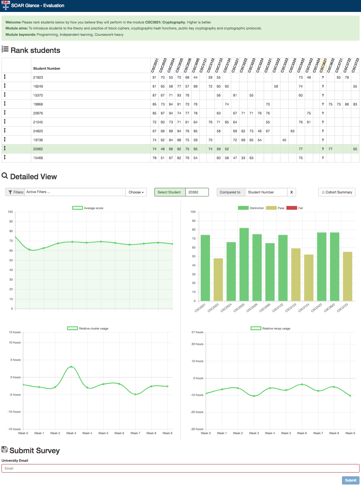
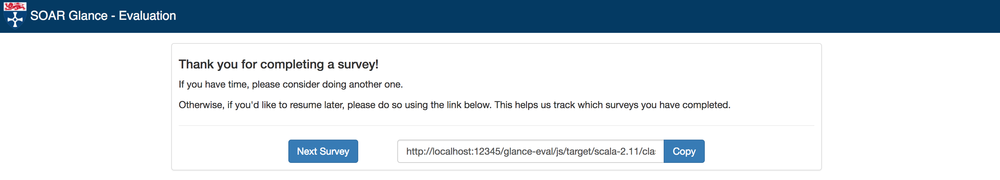

## Student Outcome Accelerator (SOAR) - Glance

Welcome to the source code repository for Glance, a web application designed to
measure the accuracy of instructors' models of student performance in higher
education institutions. 

The tool was created as part of a [HEFCE](http://www.hefce.ac.uk/) funded
project at [Newcastle University](http://www.ncl.ac.uk/), focusing on "Human in
the Loop" Learning analytics.  It remains under active development.

### How it works

Lecturers (sometimes also refered to as instructors throughout this
documentation) are given a long url pointing to a specific Glance "Survey". When
followed, this link will present instructors with a simple table, containing
module attainment scores for a small number of anonymised students. Please see
the example below: 

You should notice the green banner above the table, describing an individual
module, which we will call the **Rank Module**.

Given such a Glance "Survey", it is each lecturer's job to sort the table of
students by how well they believe each will perform at the **Rank Module**,
based initially on just performance in other modules. Obviously this means that
module scors ofor the **Ranked Module** can't be included, so the entries for
the relevant column are replaced with "?".

The sorting of the student table is achieved by a drag-and-drop interface.
Lecturers should click on the black arrow at the left hand end of each row.
Holding the mouse button down they should then move the row to whatever they
believe is the correct position for that student, relative to the others in the
table. Note that the sorting is assumed to be in **Descending order**, i.e.
higher is better.

Note that if lecturers would like to see the titles of modules other than the
**Rank module**, rather than just their identifying codes, they may hover the
mouse over the module code in question.

Once a lecturer is satisfied with the order they have created, they should click
the **Continue** button. When they do this, they will be presented with a very
similar page to the one they have just left: a simple table of student scores,
once again unsorted. This time, however, if they click on a student row
(anywhere in the row, not dragging it by the black arrow on the left), they
should see a number of visualisations depicting other aspects of a student's
behaviour and engagement, both past and present. This more detailed view should
look something like the below: 

The exact visualisations on display may vary from survey to survey, as the
efficacy of visualisations is one of the things that "Glance" is trying to test,
however the view should be similar. 

In this example, you are seeing:

* **[TOP LEFT]** The trend in a studen't average score (across all modules) over
    time.

* **[TOP RIGHT]** A student's attainment scores on previous modules, colour
    coded by whether their score represents a failing, passing or distinction
    grade.

* **[BOTTOM LEFT]** A student's usage of computer clusters throughout the time
    in which **Rank Module** is running. This line chart is indexed against the
    mean cluster usage for all students registered on **Rank Module** (not just
    those included in the table). Therefore, if for a given week the chart shows
    that a student's cluster usage is -2 hours, this means that they have spent
    2 hours less than the average in a cluster that week.

* **[BOTTOM RIGHT]** The amount of time a student spends watching digital
    lecture recordings each week. This line chart is also indexed against the
    mean for all students registered on **Rank Module**, much the same as the
    previous chart.

Lecturers should use these visualisations to examine students and sort them as
they did on the previous page. However, there two features which
designed to help lecturers make more accurate inter-student comparisons on this
second page, for example: 

---------------------------

**1. Comparing students directly**

If you click anywhere on the "Compared to" box, it should highlight a blue
colour. If you then hover over the student table again you will notice that
the row highlight has turned from green to blue. When in this comparing
mode, if you click on a student row, that studen will be highlighted in blue
and their information will be added to the visualisations below (again, all
in blue). This allows you to compare between a "Selected" and "Compared"
student. 

You can click on other student rows to make them the currently
"Compared" student, or you can click the **X** in the Compared student cell
beneath the table to clear it all together. If you want to change the
currently "Selected" student but you are in comparing mode (the "Compared
to" cell is highlighted blue), you should click anywhere on the "Select
Student" cell, which should highlight it in green and switch your mode. 

Remember that you can always tell which mode you're in by the colour table rows
are highligted with when you hover over them. The gif below should provide an
example of the entire "Select"->"Compare"->"Select" workflow:

**2. Filtering modules**

If you examine the green banner at the top of the page you will see that
there is a field called "Module Keywords". The comma separated phrases in this
field describe features of the **Rank Module**. These features may then be used
to filter supported visualisations to only contain data for modules which have
the same keyword. For instance, if you wanted to see how a student did on
modules which required "Independent Learning", you would select that filter from
the drop-down list. You can apply multiple filters, or remove filters by
clicking the small **x** symbols. The gif below provides an example of how this
should work:

---------------------------

Once a lecturer is happy with the order into which they have sorted the student
table, they should type their email into the form and click Submit. They will
then be presented with a thank you page, as the survey is over. If the
survey forms part of a collection (details [here](INSTRUCTIONS.md)) then the
thank you page will include instructions to allow lecturers to progress to the
next survey if they wish to. This essentially starts the whole process above
over, with a different table of students and potentially a different **Rank
Module**. A collection thank you page will look like the below: 

### Use cases

The Glance application provides a framework for: 

* Evaluating the impact of different instructor facing dashboards, by measuring
the accuracy of instructors’ mental models of student performance when
presented with each.

* Capturing instructor predictions about student performance through an
intuitive and easy-to-use interface. These may then be measured for accuracy
against students’ true performance and used to improve simple machine learning
models. 

* **???** There are potentially (hopefully) applications for Glance or something
    extending it which we have not yet thought of. If you think you have thought
    of one, we'd appreciate it if you wanted to leave an [issue](https://github.com/NewcastleComputingScience/soar-glance/issues) and share.

### Using Glance at your University

In order for Glance to be applicable at other institutions, we have provided
extensive [setup instructions](INSTRUCTIONS.md) along with helper scripts for
automatic (un)installation of the application and its dependencies.

Whilst the application is still under active development (as of 08/01/2018), if 
you would like to use Glance, please get in touch with [Dr. Matt
Forshaw](mailto:matthew.forshaw@ncl.ac.uk). We will try and work directly with a
small number of beta testers to address any issues you may end up having. For
anyone else who is just cloning this repository and diving in, please note we
probably can't offer any kind of support if you run into problems. Its always
worth submitting an [issue](https://github.com/NewcastleComputingScience/soar-glance/issues)
just in case though!
